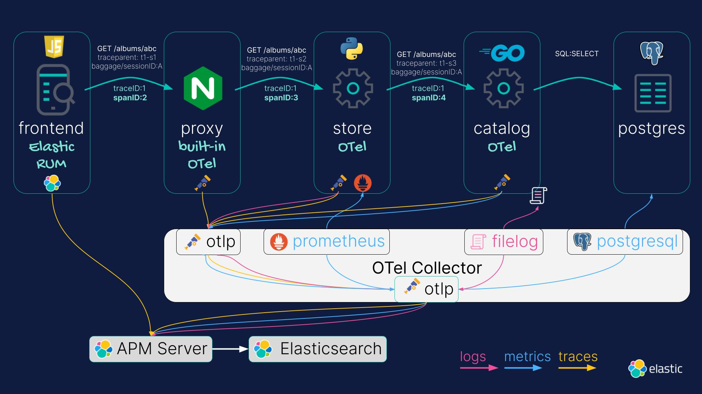

# Getting Started

1. Open a Terminal in VS Code (drag divider from bottom)
2. `cd` to `/workspace`
3. `docker-compose build`
4. `docker-compose up`

# Playing around

* use the "Record Store" tab to interact with the UI
* use the "Elastic - APM" tab to interact with Elastic APM

# Architecture

